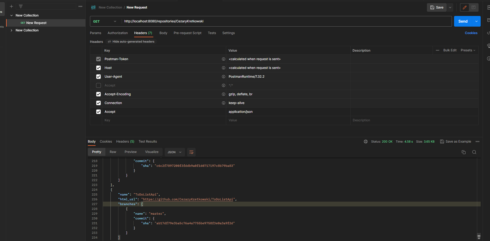

# Api Task

## Description
The aim of the project was to create a simple server that would allow downloading information about pjkets from github repositories for a given user.The application was written using the Spring boot framework. It issues an endpoint which returns a list of repositories for a given user. For each repository, it also returns a list of branches and the last commit made within a given branch.

## Instalation 
Java version 11 is required to run the application.
To build aplication go to ApiTaks folder and run 

Project download:
1. Clone a Git repository with the command: git clone https://github.com/CezaryKretkowski/ApiTask.git
2. You can also download the project as a ZIP archive from the project's GitHub page.
3. Launch intelij iDE and select open. Then search for the downloaded project.
4. Next run ApikTaksAplication  main()

## Example of use.

To test the programs you need an external application that allows you to perform http queries like postman.
The query body looks like this:
```
http://localhost:8080/repositories/{username}
```
In the query header, pass the accept parameter "application/json"
for "application/json" header, server will return code 406


